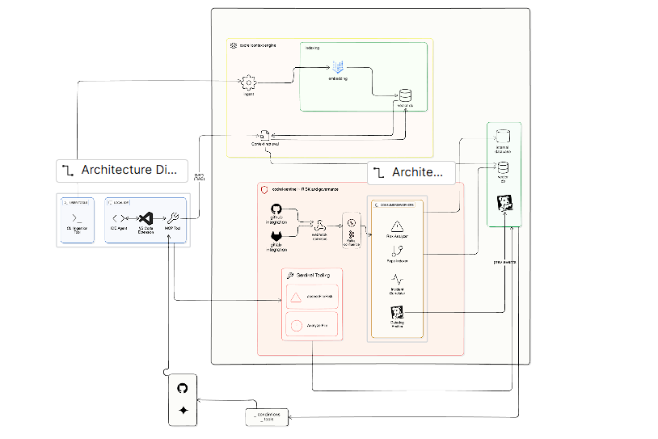

# Codrel Sentinel

**A Context & Safety Engine for AI Coding Agents**

> AI coding agents don’t fail because they can’t write code.
> They fail because they don’t remember what broke before.

**Codrel Sentinel** is a **repository-aware context engine** that gives AI coding agents and PR bots a **living memory of a codebase**—so they know **which files are fragile, what failed historically, and why** *before* they change anything.

Sentinel does **not replace agents**.
It **feeds them the missing context** they need to act safely.

---

## The Problem

Modern AI coding agents operate in a dangerous blind spot:

* They have **no memory of past failures**
* They don’t know which files caused:

  * CI outages
  * rollbacks
  * security regressions
  * production incidents
* Every agent **re-discovers the same mistakes**
* Context is lost between PRs, tools, and developers

### Real Example

An agent refactors `security.js`:

* Looks clean
* Passes unit tests
* Breaks authentication in production

Why?
Because **that file has a history of subtle auth regressions**—but the agent never saw it.

That knowledge exists in:

* old PRs
* reverted commits
* CI failures
* GitHub issues

**But no AI agent sees it.**

---

## The Insight

> **Codebases already contain institutional memory — it’s just fragmented and unusable by AI.**

Codrel Sentinel turns that scattered history into:

* **durable, queryable context**
* **file-level risk awareness**
* **real-time safety signals** for agents and bots

---

## The Solution

**Codrel Sentinel is a repository context engine that:**

1. **Analyzes repository history once**
2. **Keeps it continuously in sync**
3. **Serves that context to AI agents and PR bots on demand**

No re-learning.
No guessing.
No blind refactors.

---

## High-Level System Flow

```
Repository Connected
        ↓
Async Historical Analysis
        ↓
File-Level Risk & Context Built
        ↓
Context Stored + Continuously Updated
        ↓
IDE Agents & PR Bots Query Sentinel
        ↓
Agents Act With Historical Awareness
```

---

## What Happens When a Repo Is Connected

### 1. Initial Repository Analysis (Async, Scalable)

When a repository is connected (GitHub today):

Sentinel asynchronously analyzes:

* Pull request history
* Reverted and rolled-back changes
* CI / workflow failures
* Issues linked to files
* Sensitive paths (auth, infra, payments, security)

This work is handled by **background workers**, not blocking APIs.

---

### 2. Historical Intelligence via Gemini

For each critical file or module, Sentinel uses **Gemini** to answer:

* *Why did this break before?*
* *What patterns repeat here?*
* *Which changes are historically risky?*

This produces **compressed, durable context**, for example:

* “Changes to `security.js` frequently caused auth regressions”
* “Refactors in `payment-service/` led to rollback PRs twice”
* “This module is fragile during dependency upgrades”

This context is:

* computed once
* stored centrally
* reused by every agent and bot

---

## Continuous Sync (The Repository Has Memory)

Sentinel is **not a one-time scan**.

Whenever this happens:

* PR merged or reverted
* Issue opened or closed
* CI or workflow fails

The event is:

1. Ingested via webhooks
2. Published to **Confluent Kafka**
3. Processed asynchronously by workers
4. Merged into existing repository context

The repository’s memory **evolves continuously**.

---

## How IDE Agents Use Sentinel (MCP)

When an AI agent edits code inside the IDE:

### Example

Agent modifies `security.js`

The agent calls an MCP tool:

```
check_file_safety
```

Sentinel responds with **facts**, not opinions:

* historical failures tied to the file
* why it’s considered risky
* examples of past breakages
* areas that should not be touched lightly

**Sentinel does not reason for the agent.**
It provides **ground truth context** so the agent reasons correctly.

---

## How SentinelBot Reviews Pull Requests

When a pull request is opened or updated:

1. SentinelBot receives:

   * diff
   * changed files
   * PR metadata
2. Workers fetch **pre-built historical context**
3. Gemini analyzes the PR **in light of past failures**
4. SentinelBot posts a PR comment explaining:

* which files are fragile
* what broke before
* why this change is risky
* what to watch out for

This is **history-aware review**, not generic AI feedback.

---

## Event & Worker Backbone (Confluent)

**Confluent Kafka** powers all async processing:

* repository indexing
* history synchronization
* PR analysis
* alert pipelines

This enables:

* non-blocking APIs
* horizontal scaling
* replayable analysis
* failure isolation

---

## Observability & Reliability (Datadog)

Sentinel emits high-signal telemetry for:

* API latency and errors
* webhook ingestion health
* worker execution and retries
* Kafka consumer lag
* AI request failures and latency

**Datadog** is used to:

* monitor system health end-to-end
* detect anomalies in async pipelines
* trigger alerts when thresholds are breached

This ensures Sentinel remains reliable as:

* repositories grow
* agents increase
* background workloads scale

---

## Incident-Grade Voice Alerts (ElevenLabs)

For **critical risk events only**:

1. Datadog triggers a webhook
2. Sentinel publishes a Kafka job
3. A worker:

   * uses Gemini to generate a concise explanation
   * uses **ElevenLabs** to synthesize voice
4. A voice alert is triggered

Voice is reserved for **high-severity signals**, not noise.

---

## Architecture



---

## What Codrel Sentinel Is (and Is Not)

### Sentinel **is**

* a repository context engine
* a long-term memory layer for AI agents
* a safety system for AI-driven code changes
* a bridge between repo history and automation

### Sentinel is **not**

* a linter
* a CI system
* a code generator
* a chatbot
* a replacement for human review

---

## Why This Matters

Without Sentinel:

* agents repeat the same failures
* risky files are refactored blindly
* institutional knowledge is lost

With Sentinel:

* agents act with historical awareness
* PR reviews are grounded in reality
* teams build **persistent AI-safe memory**

---

## One-Line Summary

> **Codrel Sentinel gives AI agents and PR bots a living memory of a repository — so they know what’s fragile, what’s safe, and why, before they change anything.**

