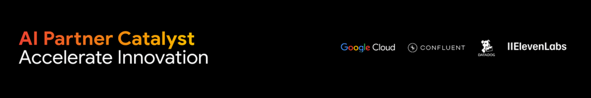
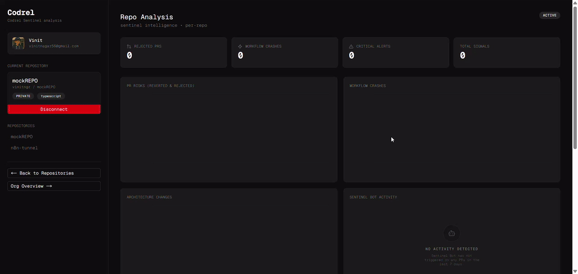
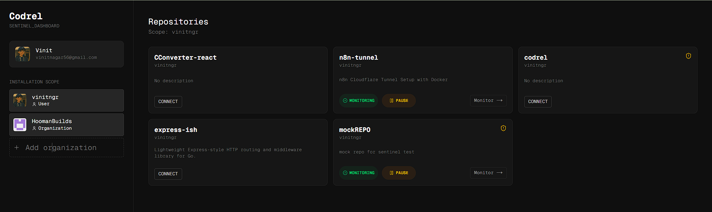
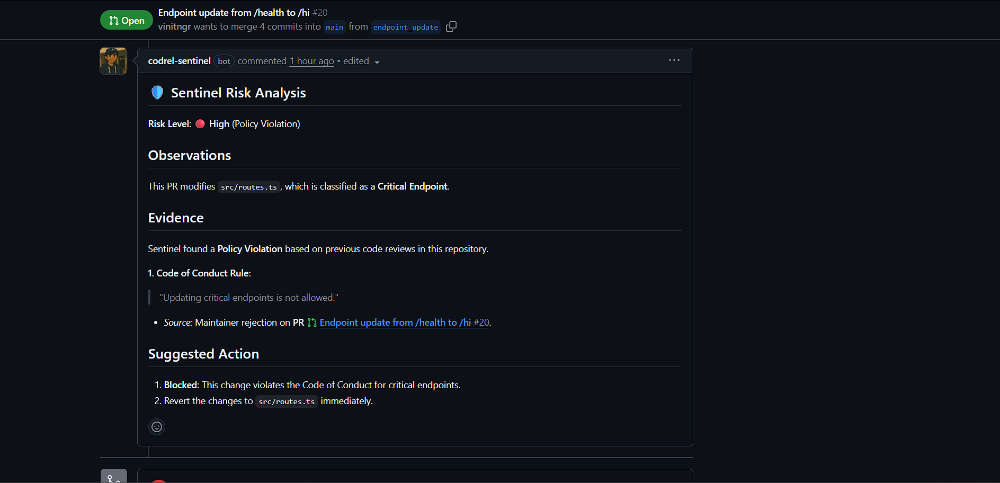
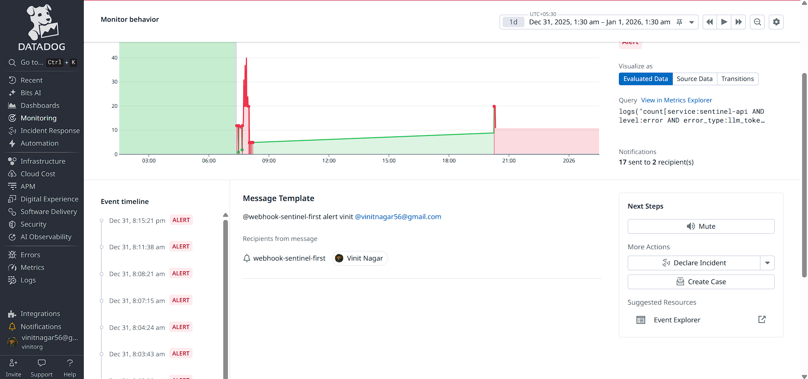

# Codrel Sentinel

A Context & Safety Engine for AI Coding Agents

AI coding agents don’t fail because they can’t write code.
They fail because they don’t remember what broke before.

Codrel Sentinel gives AI coding agents and PR bots a persistent, repository-level memory — so they understand which files are fragile, what failed historically, and why, before they change anything.

This project was built during a hackathon with Google Cloud as a partner, using Gemini for historical reasoning, and Confluent Kafka as the core event backbone.

---

### What You Can See Working (Product Proof)

#### Live Event Stream & Analytics

While the deep analysis happens asynchronously in the backend, the frontend visualizes the system's heartbeat. This clip shows:

* Live event ingestion logs
* Activity graphs updating in real-time
* The system reacting to repository signals

---

#### Organization & Repo Management

The management dashboard shows all connected repositories in one place.

* repository cards with status and monitoring state
* ability to add more repositories
* ability to install the GitHub App into **any repo or organization** you control

This is where Sentinel becomes a system, not just a tool.

---

#### Pull Request Review by SentinelBot

When a PR is opened, SentinelBot reviews it with historical awareness.

* highlights fragile files
* explains what broke before
* points out why the change is risky

This is history-aware review, not generic AI feedback.

---

## Hackathon Context & Tracks

#### Primary Track (Focus): Confluent × Google Cloud

Codrel Sentinel is fundamentally an event-driven system.

All repository intelligence, risk updates, analysis jobs, and agent-facing context are powered by **Confluent Kafka** as the system backbone.

Kafka is not an add-on here.
It is the coordination layer that enables scalable, asynchronous, replayable analysis across repositories.

#### Supporting Tools

Datadog is used for observability, pipeline health, and alerting.
ElevenLabs is used only for high-severity voice alerts generated from text.

Both are intentionally scoped to critical paths only, avoiding noise and overengineering.

---

### The Problem

Modern AI coding agents operate in a dangerous blind spot.

They have no memory of past failures.
They don’t know which files are historically fragile.
They are unaware of CI breakages, rollbacks, and subtle security regressions.
The same mistakes are rediscovered repeatedly.

That context exists in PRs, CI logs, issues, and reverts — but it is fragmented, unstructured, and invisible to AI agents.

---

### The Insight

Codebases already contain institutional memory — it’s just unusable by AI.

Codrel Sentinel converts repository history into durable, structured context, file-level risk awareness, and real-time safety signals for agents and automation.

---

### Architecture

---

### High-Level Flow

Repository connected
↓
Async historical analysis
↓
File-level risk and context built
↓
Context stored and continuously updated
↓
IDE agents and PR bots query Sentinel
↓
Agents act with historical awareness

---

### Core System Design

#### Event Backbone (Confluent Kafka)

Confluent Kafka is the core of the system.

Kafka is used for:

* repository ingestion
* historical indexing
* PR and CI event streams
* asynchronous AI analysis jobs
* alert pipelines

This enables non-blocking APIs, horizontal scaling, replayable analysis, and strong failure isolation.

Sentinel is designed as an event-first system, not a request-driven one.

---

### Initial Repository Analysis

When a repository is connected, background workers asynchronously analyze:

Pull request history
Reverted and rolled-back commits
CI and workflow failures
Issues mapped to files
Sensitive paths such as authentication, infrastructure, security, and payments

There are no blocking calls and no synchronous AI requests.
All work flows through Kafka.

---

### Historical Intelligence (Gemini and Google Cloud)

For high-risk files and modules, Sentinel uses Gemini to extract why things failed before:

Repeated failure patterns
Risky refactor zones
Fragile dependency boundaries

This produces compressed, durable context such as:

Changes to security.js often caused authentication regressions
This module historically breaks during dependency upgrades
Refactors here led to multiple rollbacks

This context is computed once, stored centrally, and reused by all agents and bots.

---

### Continuous Sync (Living Memory)

Sentinel is not a one-time scan.

Whenever a PR is merged or reverted, a CI workflow fails, or an issue is opened or closed:

The event is ingested via webhook
Published to Kafka
Processed by workers
Merged into existing repository context

The repository’s memory evolves continuously.

---

### IDE Agent Integration (MCP)

When an AI agent edits a file, it queries Sentinel using MCP tools such as:

analyze_file
analyze_file_score

Sentinel responds with facts, not opinions:

Historical failures tied to the file
Why the file is considered risky
Examples of past breakages

Sentinel does not replace agent reasoning.
It supplies ground-truth context so the agent reasons correctly.

---

### Observability (Datadog)

Datadog is used deliberately, not everywhere.

Tracked signals include API latency and errors, webhook ingestion health, Kafka consumer lag, worker failures and retries, and AI request latency.

This keeps asynchronous pipelines visible and debuggable as the system scales.

---

### Critical Voice Alerts (ElevenLabs)

Voice alerts are reserved for high-severity events only.

Datadog detects a critical condition.
A webhook triggers a Kafka job.
A worker summarizes the incident using Gemini.
ElevenLabs generates a concise voice alert.

No voice spam.
Only incident-grade signals.

---

### What Codrel Sentinel Is / Is Not

Codrel Sentinel is a repository context engine, a long-term memory layer for AI agents, a safety system for AI-driven code changes, and an event-driven intelligence platform.

It is not a linter, not a CI system, not a code generator, not a chatbot, and not a replacement for human review.

---

### Why This Matters

Without Sentinel, agents repeat failures, fragile files are refactored blindly, and institutional knowledge decays.

With Sentinel, agents act with historical awareness, PR reviews are grounded in reality, and repositories gain persistent AI-safe memory.

---

### One-Line Summary

Codrel Sentinel gives AI agents and PR bots a living memory of a repository — so they know what’s fragile, what’s safe, and why, before they change anything.